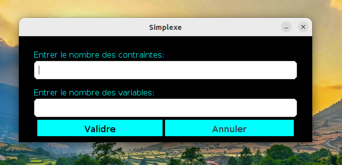
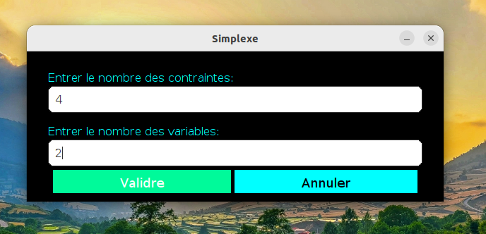
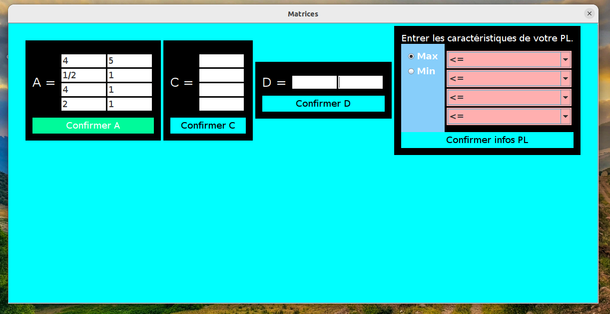
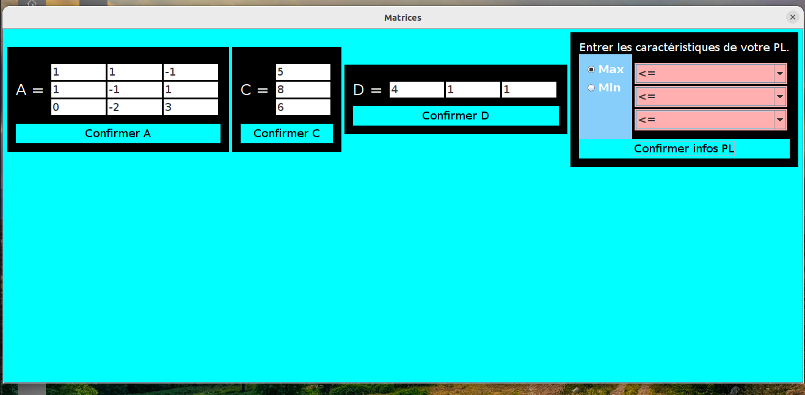
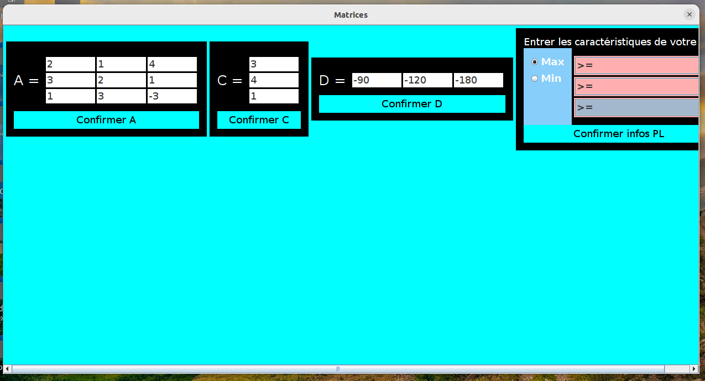
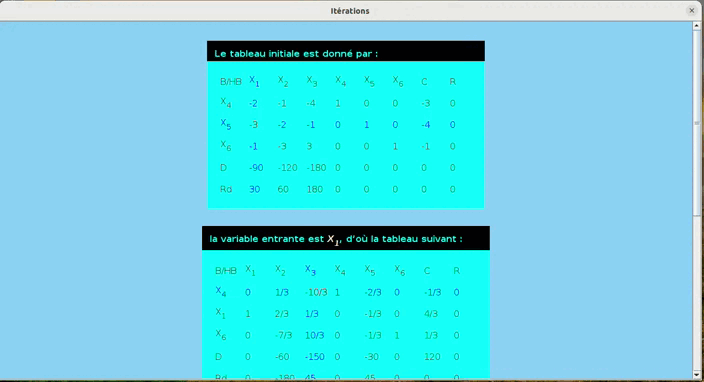
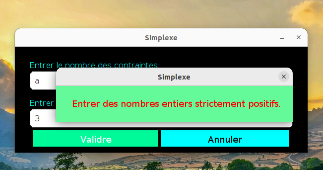
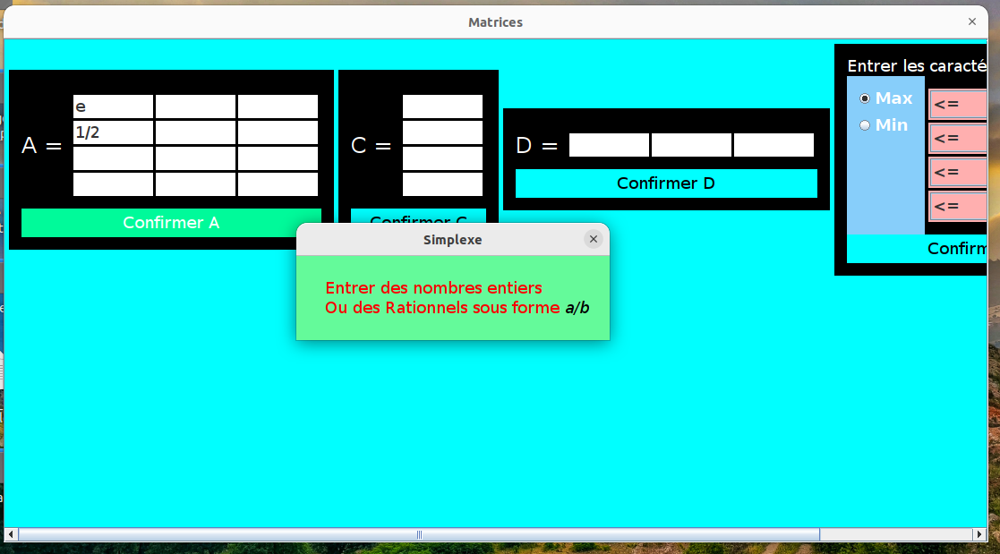
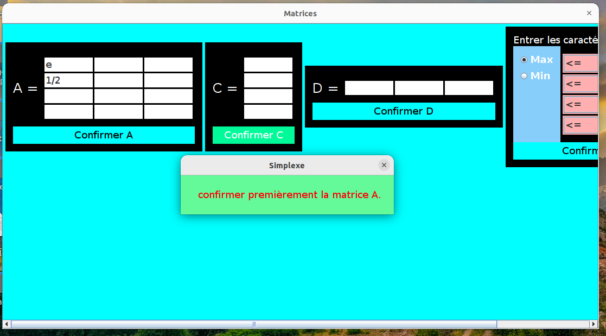

<html>
    <body>
    <h1>Application de Bureau pour la Résolution des Problèmes Linéaires</h1>
    

    Cette application de bureau est conçue pour trouver la solution optimale en nombres réels pour des problèmes linéaires en utilisant Java et Swing. Elle vise à offrir aux utilisateurs un outil intuitif et efficace pour résoudre des problèmes d'optimisation linéaire, couramment rencontrés dans la recherche opérationnelle, l'économie et divers domaines de l'ingénierie.
    

    <h3>Interface Utilisateur</h3>
    <ul>
        <li>
        Design Intuitif : L'application présente une interface conviviale conçue avec Swing, permettant aux utilisateurs de saisir facilement les contraintes de leur problème linéaire et les fonctions objectives.
        </li>
        <li>
        Composants Interactifs : Les utilisateurs peuvent interagir avec divers composants tels que des champs de texte, des boutons et des tableaux pour saisir et modifier leurs données.
        </li>
    </ul>
    <h3>Algorithme de Solution</h3>
    <ul>
        <li>
        Algorithme Simplexe : L'application utilise l'algorithme du Simplexe pour trouver la solution optimale au problème linéaire. Cela inclut les phases 1 et 2 pour traiter les problèmes d'inégalité et les solutions de base initiales.
        </li>
        <li>
        Simplexe Dual : L'application intègre également la méthode du Simplexe Dual, utile pour résoudre des problèmes où les solutions initiales ne sont pas facilement accessibles ou pour vérifier les solutions optimales.
        </li>
    </ul>
    <h3>Technologies Utilisées</h3>
    <ul>
        <li>
        Java : La logique de base et l'implémentation de l'algorithme sont réalisées en Java, garantissant une application robuste et indépendante de la plateforme.
        </li>
        <li>
        Swing : L'interface utilisateur est construite en utilisant Swing, offrant une expérience utilisateur réactive et esthétique.
        </li>
    </ul>
    <h2 id="les-processus">Les processus</h2>
    <h3 id="lancer-lapplication">1. Lancer l’application</h3>
    

    
    

    <h3 id="choisir-le-dataset">2. </h3>
    

    
    

    <h3 id="choisir-le-dataset">3. </h3>
    

    
    

    <h3 id="lecture-du-dataset">4. </h3>
    

        
    

    <h2>Exemple de l'Algorithme du Simplexe - Phase 2</h2>
    <h3 id="lecture-du-dataset">5. </h3>
    

        
    

    <h3 id="lecture-du-dataset">6. </h3>
    

        
    

    <h2>Exemple de l'Algorithme du Simplexe à 2 Phases</h2>
    <h3 id="lecture-du-dataset">7. </h3>
    

        
    

    <h3 id="lecture-du-dataset">8. </h3>
    

        
    

    <h2>Exemple de l'Algorithme Dual du Simplexe</h2>
    <h3 id="lecture-du-dataset">9. </h3>
    

        
    

    <h3 id="lecture-du-dataset">8. </h3>
     

    
    

    <h2>Gestion des Exceptions</h2>
    <h3 id="lancer-lapplication">1.</h3>
    

    
    

    <h3 id="choisir-le-dataset">2. </h3>
    

    
    

    <h3 id="choisir-le-dataset">3. </h3>
    

    
    

    </body>
</html>